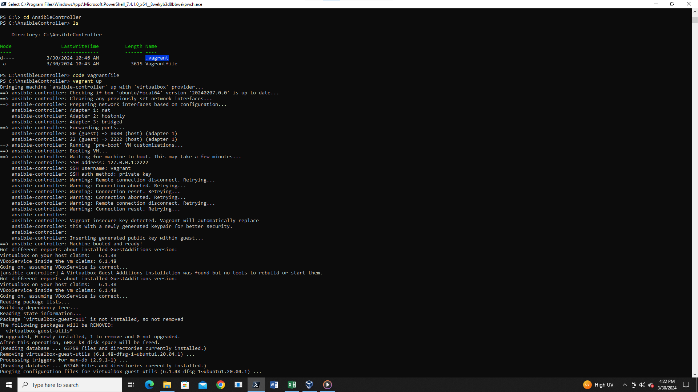
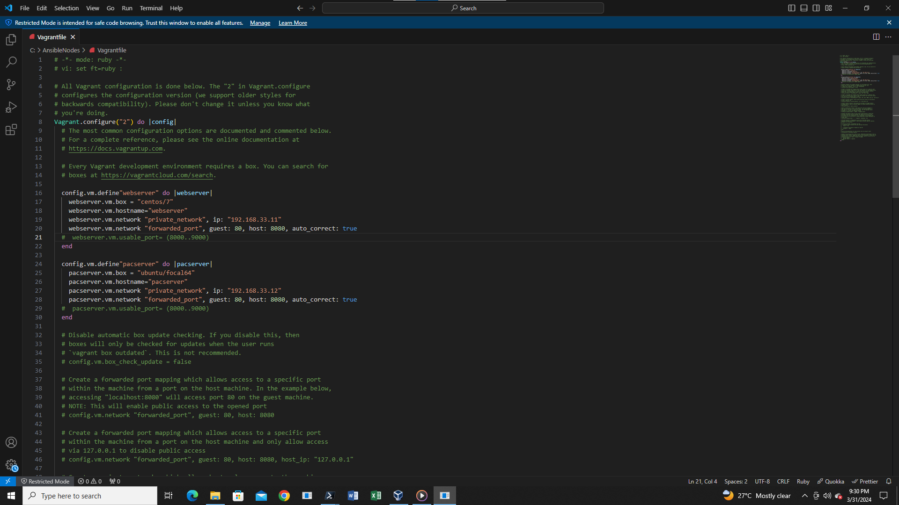
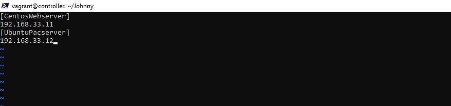

# Ansible-Assignment

# ANSIBLE PROJECT.

## TASKS;

1.  Deploy an open source app on Github using ansible

1.  Your ansible slave will consist of one ubuntu node and one CentOS (rhel) node.

1.  Your master node can be any Linux distribution of your choice (3 nodes in all).

1.  Explore using variables in ansible while executing this task.


**INTRODUCTION**

Ansible provides open-source automation that reduces complexity and runs everywhere. Using ansibles makes it very efficient for us to automate virtually any task. Ansible uses simple, human readable scripts called playbooks to automate tasks. Whenever you declare the desired state of a local or remote system in your playbook, ansible ensures thatt the system remains in that state. 

In this project, I tried to automate a tasks from my ansible controller which manages two nodes/slaves, Ubuntu and CentOS. The task is to deploy a website already in my Github account using ansible. This App is supposed to show at both ends of the two ansible nodes. 

I achieved these tasks solely using vagrant. 

## PART 1 - Setting up Your Ansible Controller

- The first step is to set up your virtual machine, that is the ansible controller and ensure that it is running via your virtual box, or VM ware, depending on your preferences.

- While setting up your virtual machine, there are some configurations you need to do in your vagrantfile before you can start up your machine. 

- Open a folder on your desktop with the title, 'AnsibleController'. Then run a ```vagrant init``` so you can pull in a vagrantfile for your controller.

- As soon as this is done, open your vagrantfile with any preferred choice of your code editor; VS code, powershell, or Gitbash. In my own case, I used VSCode to edit because I worked with powershell terminal. 

- Then start with these configurations in this order. The marked areas are your areas of interest. 


- Configure your Ansible Controller hostname. (*The marked areas are to be uncommented in your ansible controller vagrant file*)
  
  


- FURTHER EDIT YOUR VAGRANTFILE SO WHILE YOUR MACHINE IS COMING UP, IT AUTOMATICALLY INSTALLS ANSIBLE ALONGSIDE.

  
   
- *REMEMBER YOU ARE ONLY INSTALLING ANSIBLE IN YOUR ANSIBLE CONTROLLER AND NOT ON THE NODES.*

  


- It is important to note that within the course of your installing your ansible controller, you might come across series of problems, like ```Permision denied (public key)```. In this case, add to your file; ```config.ssh.insert_key = false``` 
- Also, your ansible controller might collide with your ansible nodes in communicating on port 8080. To avoid these problems, set it within a range from 8000 t0 9000 so it autocorrects and picks a free port in order to avoid collisions whenever there is a conflicting server communicating on the same port. Solve these two problems by editing your vagrantfile as follows;


- Ensure you have latest versions of virtualbox Guest additions by running ```vagrant plugin update``` and ```vagrant plugin repair```. That is if the guest additions on your VM does not match the installed version of VirtualBox. So, its recommended that you make sure the guest additions within the virtual machine match the version of VirtualBox you have installed on your host. And incase your machine doesn't support it or they seem to be conflicting, that is the one on your VM and the one on your VirtualBox, you can try removing the plugin in your VM entirely by running ```vagrant plugin uninstall vagrant-vbguest``` This is to ensure a seamless process while your machine is spinning up.
  
- When you are done, ensure you run a ```vagrant validate``` so you can fix any errors if there are. If there are no errors, vagrant will alert you with the message of a successful validation. 

- Next, you run in your terminal; ```vagrant up``` Your will be greeted with an interface as this;



- When your machine is up and running, run ```ansible --version``` to see the version of the ansible installed.


- Go to your home directory on your terminal, create a directory. And inside the directory, create two files that will contain your inventory file or hosts and your playbook.yaml file.

  ```
  vagrant@controller:~$ mkdir server
  vagrant@controller:~$ cd server
  vagrant@controller:~/server$ touch hosts playbook.yml

  ``` 

- On your home directory, generate ssh keys and copy the public keys, that is the ```id_rsa.pub``` to your notepad. because you will still be needing them in your ansible nodes. 

```
vagrant@controller:~$ ssh-keygen
vagrant@controller:~$ cd .ssh
vagrant@controller:~/.ssh$   ls
vagrant@controller:~/.ssh$   cat id_rsa.pub
```

## PART 2 - Setting up Your Ansible Nodes/Slaves

- The same you created a directory on your desktop for your ansible controller. Do the same, but this time, name it ansibleNodes. Open it with any terminal and run a ```vagrant init```
- As soon as your vagrantfile is initialized, run and edit these configurations marked in the attached picture.




**This configuration names the CentOS slave, webserver and assigns it an IP address. It also names the Ubuntu slave, pacserver as well as assigns it an IP address.** 

-  *Ensure to run a ```vagrant validate``` inorder to get rid of errors.* Afterwards, do a ```vagrant up``` *This will install both your CentOS/7 and ubuntu/focal64 as your ansible nodes/slaves.* 


- When the nodes are up and running, you will need to log into the two virtual machines. To achieve this, in your terminal run ```vagrant ssh webserver``` This will allow you log in to the CentOS/7 ansible slave and ```vagrant ssh pacserver``` logs into the Ubuntu server. 
- Remember when you created ssh keys on your Ansible controller. Its time to use the public keys you copied to your notepad. This will make it possible for you to be able to log into your ansible slaves from your Ansible controller.

- First, connect to your CentOs/7 server with the command ```vagrant ssh webserver``` Navigate to the ```.ssh``` directory and copy the ansible controller public keys to the authorized keys of the CentOS. Here's a code guide;
  
  ```
  [vagrant@webserver ~]$ cd .ssh
  [vagrant@webserver ~]$ ls
  [vagrant@webserver ~]$ vi authorized_keys
  ```

  **When you open the ```authorized_keys```, paste the public key from the ansible controller in there. Then log out from the CentOS by doing ```exit```. Log into the Ubuntu server and do exactly the same as follows;**

```
vagrant@pacserver:~$ cd .ssh
vagrant@pacserver:~$ ls
vagrant@pacserver:~$ nano authorized_keys
```


- You can run the command ```ip a``` on both nodes to see the ip address of the nodes listed as the last in the list.


## PART 3 -Connecting to your nodes through your Ansible Controller And writing your Inventory File and Playbooks.

- To connect to one of your nodes, through your ansible controller, run the command in your ansible controller; ```ssh vagrant@192.168.33.11``` The IP address is that of the CentOS. And so, the controller will connect immediately to the CentOS node. 
- Next is to create an inventory file or host that will ping the two nodes or virtual machines already set up. To achieve this, in the terminal of your ansible controller, create a directory. Then inside your directory, create a file called inventory or host. Inside this file is where you will be creating groups for your machines so its easy to ping from ansible to those nodes. 
  ```
  vagrant@controller:~$ mkdir ansible
  vagrant@controller:~/ansible$ vim host
  ```

- This is how your inventory file should look; 
  


- Afterwards, ping your two machines to be sure they are running well. To achieve this, run the command; ```ansible all -m ping -i host``` Where the "host" is the title you gave to your inventory file.
- Then create your playbook, which is usually a yaml file inside the same directory with your inventory file by running the command ```vim playbook.yml``` This allows you to start writing into your playbook with the vim editor. 
  
  
  *This is a sample of a playbook that will carry out the tasks of this project;*


```
---
- name: Deploy web application
  hosts: all
  become: yes
  vars:
    apache_service_name_centos: "httpd"
    apache_service_name_ubuntu: "apache2"
    apache_document_root: "/var/www/html"
    github_repo_url: "https://github.com/Chigbo-Asomugha/AltSchool-Assignment-1.git"

  tasks:
    - name: Update package cache (Ubuntu)
      apt:
        update_cache: yes
      when: ansible_distribution == 'Ubuntu'

    - name: Update packages (Ubuntu)
      apt:
        upgrade: yes
        autoremove: yes
      when: ansible_distribution == 'Ubuntu'

    - name: Update package cache (CentOS)
      yum:
        update_cache: yes
      when: ansible_distribution == 'CentOS'

    - name: Update packages (CentOS)
      yum:
        name: "*"
        state: present
      when: ansible_distribution == 'CentOS'

    - name: Install Git (Ubuntu)
      apt:
        name: git
        state: present
      when: ansible_distribution == 'Ubuntu'

    - name: Install Git (CentOS)
      yum:
        name: git
        state: present
      when: ansible_distribution == 'CentOS'

    - name: Install Apache2 (Ubuntu)
      apt:
        name: apache2
        state: present
      when: ansible_distribution == 'Ubuntu'

    - name: Install Apache2 (CentOS)
      yum:
        name: httpd
        state: present
      when: ansible_distribution == 'CentOS'

    - name: Clone GitHub repository
      git:
        repo: "https://github.com/Chigbo-Asomugha/AltSchool-Assignment-1.git"
        dest: "/home/vagrant/web"
      become: yes

    - name: Copy web application to Apache document root (Ubuntu)
      copy:
        src: "/home/vagrant/web/"
        dest: "/var/www/html"
        remote_src: yes
        force: yes
      when: ansible_distribution == 'Ubuntu'

    - name: Copy web application to Apache document root (CentOS)
      copy:
        src: "/home/vagrant/web/"
        dest: "/var/www/html"
        remote_src: yes
        force: yes
      when: ansible_distribution == 'CentOS'

    - name: Ensure correct ownership and permissions (Ubuntu)
      file:
        path: "/var/www/html"
        owner: www-data
        group: www-data
        mode: "0755"
      when: ansible_distribution == 'Ubuntu'

    - name: Ensure correct ownership and permissions (CentOS)
      file:
        path: "/var/www/html"
        owner: apache
        group: apache
        mode: "0755"
      when: ansible_distribution == 'CentOS'

    - name: Restart Apache2 service (Ubuntu)
      service:
        name: apache2
        state: restarted
      when: ansible_distribution == 'Ubuntu'

    - name: Restart httpd service (CentOS)
      service:
        name: httpd
        state: restarted
      when: ansible_distribution == 'CentOS'
```


- When you are done writing your playbook, run your playbook with the command; ```ansible-playbook -i host playbook.yml``` Where the "host" is your inventory file name, while the "playbook.yml" is the yaml file, ansible will be using to execute your tasks. In this case it will deploy a web application it cloned already from Github repository, using apache.
  
